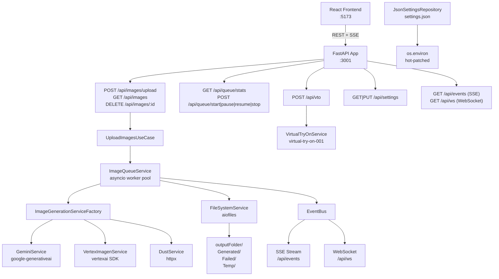

# AI Bulk Image Generator — Project Documentation

> **Version:** 2.0.0 (Python/FastAPI backend) | **Last Updated:** June 2026
> **Stack:** Python 3.11 · FastAPI · Uvicorn · Vertex AI SDK · React 18 · TypeScript · Vite · Tailwind CSS

---

## 1. Executive Summary

### Project Purpose
AI Bulk Image Generator is a production-grade SaaS platform that allows users to **transform product photographs at scale using AI**. Users upload batches of images, describe a transformation via a text prompt, and the system processes every image through a chosen AI provider — returning professionally generated outputs.

### Business Goal
Automate e-commerce and marketing photo production workflows. Replace manual photography sessions with AI-generated shots: lifestyle photos, background changes, studio compositions, and Virtual Try-On (placing shoes/clothing onto model photos).

### Core Functionality
- **Bulk Image Processing** — upload up to 1,000 images in one session, queue them for AI transformation with a single shared prompt.
- **Virtual Try-On (VTO)** — place a product (shoe, bag, garment) onto a model photo using `virtual-try-on-001` on Vertex AI.
- **Multi-Provider AI** — switch between Google Gemini (direct), Vertex AI (Imagen 3 + VTO), and Dust.tt agent.
- **Live Queue Monitoring** — real-time progress via Server-Sent Events (SSE) and WebSocket.
- **Persistent Settings** — JSON-backed settings repository, hot-reloaded without restart.

### Main User Workflow
```
Upload Images + Prompt → Queue → AI Generation → Generated Gallery → Download
```
For VTO:
```
Upload Person Photo + Product Photo → POST /api/vto → AI Result → Download
```

### Problem Being Solved
Manual product photography is slow and expensive. This system provides a scalable, API-driven alternative that processes hundreds of product images overnight and surfaces results through a polished SaaS interface.

---

## 2. System Architecture

### Architecture Style
- **Layered Clean Architecture** (Domain → Application → Infrastructure → Presentation)
- **Event-Driven Queue** via `asyncio` worker pool + `EventBus`
- **REST + SSE + WebSocket** for client communication
- **Provider Strategy Pattern** — pluggable AI backends behind a common interface

### Architecture Diagram



### Request Lifecycle (Bulk Upload)
```
POST /api/images/upload (multipart)
  → images.router.upload()
  → UploadImagesUseCase.execute()
    → validate each file (mime, size)
    → write temp file (Temp/)
    → queue.create_job()
    → queue.add_jobs() → wake workers
  → return UploadResultDTO

Worker picks up job:
  → fs.read_image_as_buffer(temp_path)
  → service_factory.get_service()
  → service.generate_image(request)
  → fs.save_generated_image(output, "Generated")
  → job.mark_as_completed(output_path)
  → events.emit("job:completed")
  → SSE pushes to browser
```

### Request Lifecycle (Virtual Try-On)
```
POST /api/vto  { personImage: b64, productImage: b64 }
  → vto.router.virtual_try_on()
  → validate + strip data-URL prefix
  → vto_service.try_on(VTORequest)
    → asyncio.to_thread(_try_on_sync)
      → PredictionServiceClient.predict(virtual-try-on-001)
  → return { image, mimeType, dataUrl }
```

---

## 3. Repository Structure

```
ai-bulk-python/
├── app/
│   ├── main.py                          # FastAPI entrypoint, CORS, router wiring, lifespan
│   ├── __init__.py
│   │
│   ├── core/                            # Cross-cutting concerns
│   │   ├── config.py                    # Pydantic-settings AppConfig (all env vars)
│   │   ├── errors.py                    # Exception hierarchy (AppError subclasses)
│   │   ├── events.py                    # EventBus (asyncio queue fan-out)
│   │   └── logging.py                   # Structured JSON + console Logger
│   │
│   ├── domain/                          # Business rules, no framework deps
│   │   ├── entities/
│   │   │   ├── image_job.py             # ImageJob dataclass + lifecycle methods
│   │   │   └── settings.py              # Settings dataclass + is_valid()
│   │   └── interfaces.py               # Protocol definitions (IImageGenerationService, etc.)
│   │
│   ├── application/                     # Use cases & service orchestration
│   │   ├── dto.py                       # Pydantic DTOs (JobResponseDTO, QueueStatsDTO, etc.)
│   │   ├── services/
│   │   │   └── queue_service.py         # ImageQueueService (asyncio worker pool)
│   │   └── use_cases/
│   │       └── image_use_cases.py       # UploadImagesUseCase, GetGalleryUseCase, etc.
│   │
│   ├── infrastructure/                  # External adapters
│   │   ├── config/
│   │   │   └── json_settings_repository.py   # Persists settings.json, hot-patches env
│   │   ├── filesystem/
│   │   │   └── filesystem_service.py    # Async file I/O, directory management
│   │   ├── providers/
│   │   │   ├── gemini_service.py        # Gemini API (google-generativeai)
│   │   │   ├── vertex_imagen_service.py # Vertex AI Imagen 3 (vertexai SDK)
│   │   │   ├── vertex_vto_service.py    # Virtual Try-On (virtual-try-on-001)
│   │   │   ├── dust_service.py          # Dust.tt agent (httpx polling)
│   │   │   └── factory.py              # ImageGenerationServiceFactory
│   │   └── repositories/
│   │       └── in_memory_job_repository.py   # Thread-safe in-memory job store
│   │
│   └── presentation/                   # HTTP layer
│       ├── container.py                # DI composition root
│       ├── middleware.py               # Error normalization, request logger
│       ├── schemas.py                  # Pydantic request schemas
│       └── routers/
│           ├── images.py               # /api/images/*
│           ├── queue.py                # /api/queue/*
│           ├── settings.py             # /api/settings/*
│           ├── vto.py                  # /api/vto
│           ├── events.py               # /api/events (SSE) + /api/ws (WebSocket)
│           └── health.py               # /api/health
│
├── frontend/                           # React 18 + TypeScript SPA
│   ├── src/
│   │   ├── pages/
│   │   │   ├── DashboardPage.tsx
│   │   │   ├── UploadPage.tsx
│   │   │   ├── VirtualTryOnPage.tsx    # VTO single + bulk mode
│   │   │   ├── QueuePage.tsx
│   │   │   ├── GalleryPage.tsx
│   │   │   └── SettingsPage.tsx
│   │   ├── components/
│   │   │   ├── layout/
│   │   │   │   ├── Sidebar.tsx
│   │   │   │   └── AppLayout.tsx
│   │   │   └── ui/                     # button, card, input, badge, progress, select
│   │   ├── hooks/
│   │   │   ├── useSSE.ts               # EventSource connection + query invalidation
│   │   │   └── useQueries.ts           # TanStack Query hooks
│   │   ├── lib/
│   │   │   ├── api.ts                  # Typed API client
│   │   │   ├── constants.ts            # URLs, file constraints, model lists
│   │   │   ├── types.ts                # TypeScript interfaces
│   │   │   └── utils.ts               # cn(), formatters
│   │   └── store/
│   │       └── appStore.ts             # Zustand global state
│   └── package.json
│
├── Dockerfile
├── docker-compose.yml
├── requirements.txt
├── .env.example
├── settings.json                       # Runtime-persisted user settings
└── logs/
    ├── app.log
    ├── error.log
    └── processing.log
```

---

## 4. Configuration Management

### Environment Variables

| Variable | Type | Default | Required | Purpose |
|----------|------|---------|----------|---------|
| `PORT` | int | `3001` | No | Uvicorn listen port |
| `NODE_ENV` | string | `development` | No | `development` / `production` / `test` |
| `API_PROVIDER` | string | `gemini` | No | Active AI provider: `gemini` / `vertex` / `dust` |
| `GEMINI_API_KEY` | string | `""` | If Gemini | Google AI Studio API key |
| `VERTEX_PROJECT_ID` | string | `""` | If Vertex | GCP project ID |
| `VERTEX_LOCATION` | string | `us-central1` | No | Vertex AI region |
| `VTO_MODEL` | string | `virtual-try-on-001` | No | Virtual Try-On model ID |
| `DUST_API_KEY` | string | `""` | If Dust | Dust.tt API key |
| `DUST_WORKSPACE_ID` | string | `""` | If Dust | Dust.tt workspace ID |
| `DUST_AGENT_ID` | string | `""` | If Dust | Dust.tt agent configuration ID |
| `QUEUE_BACKEND` | string | `memory` | No | `memory` or `redis` |
| `QUEUE_CONCURRENCY` | int | `3` | No | Parallel worker coroutines |
| `QUEUE_MAX_RETRIES` | int | `3` | No | Max retry attempts per job |
| `QUEUE_RETRY_DELAY` | int | `5000` | No | Base retry delay (ms), exponential backoff |
| `QUEUE_TIMEOUT_MS` | int | `120000` | No | Per-job timeout (ms) |
| `OUTPUT_DIR` | string | `./output` | No | Default output directory |
| `MAX_FILE_SIZE_MB` | int | `20` | No | Maximum upload file size |
| `LOG_LEVEL` | string | `info` | No | `debug` / `info` / `warning` / `error` |
| `LOG_DIR` | string | `./logs` | No | Log file directory |
| `IMAGE_QUALITY` | int | `90` | No | JPEG quality (10–100) |
| `CORS_ORIGINS` | string | `http://localhost:5173,...` | No | Comma-separated CORS origins |
| `REDIS_HOST` | string | `localhost` | If Redis | Redis hostname |
| `REDIS_PORT` | int | `6379` | If Redis | Redis port |
| `REDIS_PASSWORD` | string | `""` | If Redis | Redis password |

### Settings Persistence (`settings.json`)
User settings are saved to `settings.json` in the working directory by `JsonSettingsRepository`. On every save and load, credentials are hot-patched into `os.environ` — so provider services pick up changes without restart. Secrets (`geminiApiKey`, `dustApiKey`) are masked in API responses (`****`).

---

## 5. Backend Deep Dive

### `app/core/config.py` — AppConfig
**Responsibility:** Single source of truth for all environment-driven configuration.
Uses `pydantic-settings` `BaseSettings` with `.env` file loading. Cached with `@lru_cache`. Exposes `cors_origins_list` property.

### `app/core/errors.py` — Error Hierarchy
| Class | HTTP Status | Code |
|-------|------------|------|
| `AppError` | 500 | `INTERNAL_ERROR` |
| `ValidationError` | 400 | `VALIDATION_ERROR` |
| `GeminiError` | 502 | `GEMINI_ERROR` |
| `QueueError` | 500 | `QUEUE_ERROR` |
| `FileSystemError` | 500 | `FILESYSTEM_ERROR` |
| `NotFoundError` | 404 | `NOT_FOUND` |
| `ConfigurationError` | 500 | `CONFIGURATION_ERROR` |
| `RateLimitError` | 429 | `RATE_LIMIT` |

All errors carry `message`, `code`, and `status_code`. The middleware layer (`app_error_handler`) serializes them to `{success: false, error: {code, message}}`.

### `app/core/events.py` — EventBus
**Responsibility:** Replace Node.js `EventEmitter`. Supports both:
- `on(event, handler)` / `emit(event, data)` — synchronous listener API (supports async handlers, scheduled via `loop.create_task`)
- `subscribe()` — async generator yielding `(event, data)` tuples, used by SSE and WebSocket endpoints

Each `emit()` fans out to all `asyncio.Queue` subscribers. Queue-full events drop the oldest entry to avoid blocking.

### `app/core/logging.py` — Logger
**Responsibility:** Structured logging matching the original Winston setup.
- Console: colored human-readable output
- `app.log`: JSON rotating (10MB × 5 backups), all levels
- `error.log`: JSON rotating (10MB × 5 backups), ERROR+
- `processing.log`: JSON rotating (50MB × 10 backups), all levels

API: `logger.info(msg, meta_dict)`, `.warn()`, `.debug()`, `.error(msg, exception, meta_dict)`

### `app/domain/entities/image_job.py` — ImageJob
**Responsibility:** Core domain entity representing a single generation job.

| Method | Effect |
|--------|--------|
| `mark_as_processing()` | Sets status=processing, records start time |
| `mark_as_completed(path)` | Sets status=completed, calculates duration_ms |
| `mark_as_failed(msg)` | Sets status=failed, records error message |
| `mark_as_cancelled()` | Sets status=cancelled |
| `increment_retry()` | Increments retry_count |
| `can_retry(max)` | Returns `retry_count < max` |

### `app/domain/interfaces.py` — Protocols
Defines structural typing contracts:
- `IImageGenerationService` — `generate_image(request)`, `validate_credentials()`
- `IFileSystemService` — file CRUD, directory management
- `ISettingsRepository` — `get()`, `save()`
- `IImageJobRepository` — full CRUD + stats

### `app/application/services/queue_service.py` — ImageQueueService
**Responsibility:** Asyncio worker pool for image generation jobs. Critical rewrite of the original TypeScript queue.

**Key Design Decisions:**
- `N` long-lived worker coroutines (N = `concurrent_workers`) instead of polling
- `asyncio.Lock` for atomic job claiming (no two workers take the same job)
- `asyncio.Event` (`_wake`) replaces `setInterval` — zero-latency wakeup on new jobs
- Exponential backoff: `retry_delay_ms × 2^(retry_count - 1)`
- Safety-blocked jobs (Gemini safety filter) are NOT retried

**Emitted Events:** `started`, `paused`, `resumed`, `stopped`, `job:started`, `job:completed`, `job:failed`, `job:cancelled`, `job:retrying`, `jobs:added`, `stats:updated`, `queue:complete`

### `app/application/use_cases/image_use_cases.py`
| Use Case | Responsibility |
|----------|---------------|
| `UploadImagesUseCase` | Validate files, write to Temp/, create + enqueue jobs |
| `GetGalleryUseCase` | Filter/sort/paginate jobs via repository |
| `DeleteJobUseCase` | Delete job + output file |
| `RetryJobUseCase` | Reset failed/cancelled job to pending, nudge queue |

### `app/infrastructure/providers/gemini_service.py` — GeminiService
- Uses `google-generativeai` SDK
- Model: configurable (default `gemini-2.0-flash-exp`)
- Sends image as `inline_data` + text prompt
- Extracts first `image/*` part from response candidates
- Blocking SDK calls run in `asyncio.to_thread()`
- Error mapping: API_KEY_INVALID → 400, RATE_LIMIT → 429, SAFETY → blocked, QUOTA → quota

### `app/infrastructure/providers/vertex_imagen_service.py` — VertexImagenService
- Uses `vertexai` SDK (`ImageGenerationModel`)
- Model: `imagen-3.0-generate-002`
- Calls `model.edit_image()` with `base_image`, `mask_mode="background"`, `edit_mode="inpainting-insert"`
- Auth: Application Default Credentials (ADC) — SDK handles internally
- Blocking calls run in `asyncio.to_thread()`
- Fallback: if SDK signature drifts, retries without edit parameters

### `app/infrastructure/providers/vertex_vto_service.py` — VirtualTryOnService
- Uses `google.cloud.aiplatform.gapic.PredictionServiceClient`
- Model: `virtual-try-on-001` (configurable via `VTO_MODEL` env var)
- Payload: `personImage.image.bytesBase64Encoded` + `productImages[].image.bytesBase64Encoded`
- Extracts `bytesBase64Encoded` from prediction response
- Auth: ADC (same gcloud credentials)

### `app/infrastructure/providers/dust_service.py` — DustService
- Creates a Dust.tt conversation with the image attached as base64 data-URL
- Polls GET `/assistant/conversations/{id}` every 2 seconds (max 3 minutes)
- Extracts image from agent message: data-URL regex OR file attachment
- Async HTTP via `httpx.AsyncClient`

### `app/infrastructure/providers/factory.py` — ImageGenerationServiceFactory
- Resolves active provider from `os.environ["API_PROVIDER"]` on every call
- Provider switches take effect without restart
- Methods: `get_service()`, `validate_provider()`, `get_gemini_service()`

### `app/infrastructure/filesystem/filesystem_service.py` — FileSystemService
- Output filename format: `{sanitized_name}_{timestamp}_{uuid8}.{ext}`
- Directory structure: `outputDir/Generated/`, `Failed/`, `Temp/`, `Logs/`
- All I/O is async via `aiofiles`
- `open_in_explorer()` supports Windows, macOS, Linux

### `app/infrastructure/config/json_settings_repository.py` — JsonSettingsRepository
- In-memory cache invalidated on save
- Hot-patches provider credentials into `os.environ` on every `save()` and `sync_env()`
- Secrets protected: never overwritten with masked placeholder from frontend

### `app/infrastructure/repositories/in_memory_job_repository.py` — InMemoryImageJobRepository
- Dict-backed with `asyncio.Lock` for thread safety
- Supports filter by status, search by name, sort by any field, pagination
- `get_stats()` returns counts per status + total

### `app/presentation/container.py` — Container (DI Root)
Single instance created once per process. Wires all layers. `startup()` binds event loop, patches env, ensures output dirs, starts 2-second heartbeat task. `shutdown()` gracefully cancels workers.

### `app/presentation/middleware.py`
- `RequestLoggerMiddleware` — logs method + path + response time
- `app_error_handler` — `AppError` → typed JSON response
- `unhandled_error_handler` — 500 fallback with generic message
- `not_found_handler` — 404 with route info

---

## 6. API Documentation

### Base URL
```
http://localhost:3001/api
```

All responses follow the envelope:
```json
{ "success": true, "data": { ... } }
{ "success": false, "error": { "code": "...", "message": "..." } }
```

---

### `POST /api/images/upload`
Upload images for bulk AI generation.

**Content-Type:** `multipart/form-data`

| Field | Type | Required | Description |
|-------|------|----------|-------------|
| `files` | `File[]` | Yes | Image files (JPG/PNG/WEBP, max 20MB each) |
| `prompt` | `string` | Yes | AI transformation prompt (max 2000 chars) |

**Success Response (201):**
```json
{
  "success": true,
  "data": {
    "accepted": [{ "id": "uuid", "originalName": "photo.jpg", "status": "pending", ... }],
    "rejected": [{ "filename": "bad.pdf", "reason": "Unsupported file type" }],
    "totalAccepted": 5,
    "totalRejected": 1
  }
}
```

---

### `GET /api/images`
Retrieve gallery of all jobs.

| Query Param | Type | Default | Description |
|-------------|------|---------|-------------|
| `status` | string | — | Filter: `pending/processing/completed/failed/cancelled` |
| `search` | string | — | Filename substring search |
| `sortBy` | string | `updatedAt` | `createdAt/updatedAt/originalName` |
| `sortOrder` | string | `desc` | `asc/desc` |
| `limit` | int | — | Page size |
| `offset` | int | — | Page offset |

---

### `DELETE /api/images/{id}`
Delete a job and its output file.

---

### `POST /api/images/{id}/retry`
Re-queue a failed or cancelled job (resets retry_count to 0).

---

### `POST /api/images/{id}/cancel`
Cancel a pending job.

---

### `GET /api/queue/stats`
**Response:**
```json
{
  "success": true,
  "data": {
    "total": 10, "pending": 3, "processing": 2,
    "completed": 4, "failed": 1, "cancelled": 0,
    "isRunning": true, "isPaused": false,
    "currentJobId": "uuid", "eta": 45000,
    "progressPercent": 50
  }
}
```

---

### `POST /api/queue/start | pause | resume | stop | cancel`
Queue control endpoints. `start` applies current settings (model, quality, concurrency, output dir) before starting.

---

### `GET /api/settings`
Returns settings with secrets masked (`geminiApiKey`, `dustApiKey` → `AIza****key`).

---

### `PUT /api/settings`
Update settings. Partial updates accepted. Masked secrets in the request body are ignored (original values preserved).

**Body (all fields optional):**
```json
{
  "apiProvider": "vertex",
  "vertexProjectId": "my-project-123",
  "vertexLocation": "us-central1",
  "outputFolder": "/home/user/outputs",
  "concurrentWorkers": 5,
  "retryCount": 3,
  "timeoutMs": 120000,
  "imageQuality": 90,
  "model": "imagen-3.0-generate-002"
}
```

---

### `POST /api/settings/validate-key`
Validate AI credentials without saving.

**Body:**
```json
{ "provider": "vertex", "apiKey": "optional-for-gemini" }
```

---

### `POST /api/vto`
**Virtual Try-On** — place a product onto a person photo.

**Body:**
```json
{
  "personImage": "base64string...",
  "productImage": "base64string...",
  "sampleCount": 1,
  "baseSteps": 30
}
```

Both images accept raw base64 OR `data:image/xxx;base64,...` data-URL format. The router strips the prefix automatically.

**Success Response:**
```json
{
  "success": true,
  "data": {
    "image": "base64string...",
    "mimeType": "image/png",
    "dataUrl": "data:image/png;base64,..."
  }
}
```

---

### `GET /api/events`
Server-Sent Events stream. Connect once on page load; no authentication required.

**Event Types:**
| Event Name | Payload | Description |
|-----------|---------|-------------|
| `stats` | `QueueStatsDTO` | Queue statistics update |
| `job:started` | `{jobId}` | Job picked up by worker |
| `job:completed` | `{jobId, outputPath}` | Job finished successfully |
| `job:failed` | `{jobId, error}` | Job failed (with error message) |
| `job:cancelled` | `{jobId}` | Job cancelled |
| `job:retrying` | `{jobId, retryCount}` | Job queued for retry |
| `jobs:added` | `{count}` | New jobs added to queue |
| `queue:started` | `{}` | Queue started |
| `queue:paused` | `{}` | Queue paused |
| `queue:resumed` | `{}` | Queue resumed |
| `queue:stopped` | `{}` | Queue stopped |
| `queue:complete` | `{}` | All jobs finished |

---

### `GET /api/ws`
WebSocket alternative to SSE. Same event set, JSON format: `{"event": "stats", "data": {...}}`.

---

### `GET /api/health`
```json
{ "success": true, "status": "ok", "timestamp": "2026-06-14T10:00:00+00:00" }
```

---

## 7. Queue System Documentation

### Design
- **N long-lived asyncio coroutines** (N = `QUEUE_CONCURRENCY`, default 3)
- Workers sleep on `asyncio.Event` (`_wake`) and are nudged on: new jobs added, job completed, state change
- Atomic job claiming under `asyncio.Lock` — no race conditions
- In-memory state (`InMemoryImageJobRepository`) — survives request load but not process restart

### Job Lifecycle
```
pending → processing → completed
                    ↘ failed (retryable) → pending (with backoff)
                    ↘ failed (permanent / safety blocked)
         → cancelled (via cancel endpoint)
```

### Retry Mechanism
- Max retries: `QUEUE_MAX_RETRIES` (default 3)
- Backoff formula: `retry_delay_ms × 2^(retry_count - 1)`
  - Retry 1: 5000ms
  - Retry 2: 10000ms
  - Retry 3: 20000ms
- **Safety-blocked** jobs (response contains "safety") are NOT retried

### Concurrency Model
```python
# Worker pool — N concurrent coroutines
while True:
    await _wait_for_wake()          # idle until nudged
    job = await _claim_next_job()   # atomic under Lock
    if job:
        await _process_job(job)    # includes timeout
```

### Queue Storage
Default: in-memory dict with `asyncio.Lock`. Optional: Redis (set `QUEUE_BACKEND=redis`; implementation reserved but infrastructure scaffolded).

---

## 8. AI Integration Documentation

### Provider 1: Gemini (Direct)

**Authentication:** `GEMINI_API_KEY` environment variable.

**Request Flow:**
```python
genai.configure(api_key=api_key)
model = GenerativeModel(model_name, generation_config={"response_modalities": ["Text", "Image"]})
result = model.generate_content([{"text": prompt}, {"inline_data": {"mime_type": ..., "data": buffer}}])
```

**Response Parsing:** Iterates `result.candidates[].content.parts[]` for first `part.inline_data` with `mime_type.startswith("image/")`.

**Error Handling:**
| API Error | Raised As |
|-----------|----------|
| API_KEY_INVALID / 400 | `GeminiError("Invalid Gemini API key")` |
| RATE_LIMIT / 429 | `GeminiError("rate limit exceeded")` |
| SAFETY / blocked | `GeminiError("blocked by safety filters")` |
| QUOTA | `GeminiError("quota exceeded")` |

---

### Provider 2: Vertex AI — Imagen 3

**Authentication:** Application Default Credentials (ADC). Run once:
```bash
gcloud auth application-default login
```
The `vertexai` SDK resolves credentials automatically from `~/.config/gcloud/application_default_credentials.json`.

**Request Flow:**
```python
vertexai.init(project=project_id, location=location)
model = ImageGenerationModel.from_pretrained("imagen-3.0-generate-002")
result = model.edit_image(
    base_image=Image(image_bytes=...),
    prompt=prompt,
    edit_mode="inpainting-insert",
    mask_mode="background",
    number_of_images=1,
)
```

**Image Processing:** `mask_mode="background"` instructs Imagen to keep the product and replace the background — ideal for e-commerce background transformation.

**Fallback:** If `edit_image()` signature drifts between SDK versions, falls back to `edit_image(base_image, prompt, number_of_images=1)`.

---

### Provider 3: Vertex AI — Virtual Try-On

**Authentication:** Same ADC as Imagen 3.

**Model:** `virtual-try-on-001`

**Request Payload:**
```python
instance = {
    "personImage": {"image": {"bytesBase64Encoded": person_b64}},
    "productImages": [{"image": {"bytesBase64Encoded": product_b64}}],
}
parameters = {"sampleCount": 1, "baseSteps": 30}
```

**Use Case:** Place shoes, bags, or clothing onto a person photo. The model handles perspective, lighting, and shadow matching. Product pixels are NOT regenerated — the model positions the actual product.

---

### Provider 4: Dust.tt Agent

**Authentication:** `DUST_API_KEY` + `DUST_WORKSPACE_ID` + `DUST_AGENT_ID`.

**Request Flow:**
1. Create conversation with image as base64 attachment
2. Poll GET `/assistant/conversations/{id}` every 2 seconds
3. Wait for `agent_message.status == "succeeded"` (max 3 minutes)
4. Extract image from message content (data-URL regex) or file attachments

**Rate Limiting:** Limited by Dust.tt agent quota. No local rate limiting applied.

---

## 9. Image Processing Pipeline

### Upload to Delivery

```
1. Upload (multipart POST)
   → mime validation (jpg/png/webp only)
   → size validation (≤ 20MB)
   → write to outputDir/Temp/{uuid}_{filename}

2. Queue
   → ImageJob created with status=pending
   → Worker claims job atomically

3. AI Generation
   → read_image_as_buffer(temp_path)
   → provider.generate_image(ImageGenerationRequest)
   → provider returns ImageGenerationResponse(image_buffer, mime_type)

4. Save
   → filename: {sanitized}_{ISO_timestamp}_{uuid8}.{ext}
   → written to outputDir/Generated/

5. Delivery
   → static file served at GET /output/Generated/{filename}
   → SSE job:completed event with outputPath
   → frontend constructs preview URL
```

### Supported Formats
| Input | Output |
|-------|--------|
| image/jpeg | image/jpeg or image/png (provider-dependent) |
| image/png | image/png |
| image/webp | image/png (usually) |

### File Naming
```
{sanitized_original_name}_{YYYY-MM-DDTHH-MM-SS}_{8-char-uuid}.{ext}
e.g.: product_photo_2026-06-14T13-13-00_fb3f1894.jpg
```

---

## 10. Frontend Architecture

### Stack
- **React 18** + **TypeScript** + **Vite 6**
- **Tailwind CSS** with custom design tokens (dark navy palette)
- **Framer Motion** — page transitions, sidebar animation, card hover effects
- **TanStack Query v5** — server state, gallery polling, queue stats
- **Zustand** — global UI state (page, notifications, sidebar, connected)
- **Lucide React** — icon set

### Design System
| Token | Value |
|-------|-------|
| Background | `#020B24` |
| Sidebar | `#050F2F` |
| Cards | `#091632` |
| Border | `rgba(80,120,255,0.15)` |
| Primary Blue | `#0EA5E9` |
| Text Primary | `#F8FAFC` |
| Text Secondary | `#7C8AA5` |
| Success | `#10B981` |
| Warning | `#F59E0B` |
| Danger | `#EF4444` |

### Pages
| Page | Route (NavPage) | Key Features |
|------|----------------|-------------|
| Dashboard | `dashboard` | Stats cards, live progress panel, quick actions |
| Upload Center | `upload` | Drag-drop bulk upload, prompt editor, examples |
| Virtual Try-On | `vto` | Single + bulk mode (up to 200 products), live results grid |
| Processing Queue | `queue` | Start/pause/resume/stop, per-job controls, live stats |
| Generated Gallery | `gallery` | Search, filter, lightbox, download |
| Settings | `settings` | Provider selector, credentials, output folder, processing options |

### State Management
- `useAppStore` (Zustand): `page`, `sidebarCollapsed`, `connected`, `notifications`
- `useSSE` hook: `EventSource` connecting to `/api/events`, invalidates TanStack Query caches on events
- TanStack Query: `['gallery']`, `['queue-stats']`, `['settings']`

### VTO Page — Modes
**Single Mode:** Person image (1) + Clothing image (1) → generates 1 result. Images converted to base64 client-side before sending JSON to `POST /api/vto`.

**Bulk Mode:** Person image (1) + up to 200 clothing images → processes in batches of 3 simultaneously. Progress bar updates per batch. Results grid with per-item download + "Download All".

---

## 11. Security Review

| Area | Risk | Severity | Recommendation |
|------|------|----------|---------------|
| File Upload | Malicious file disguised as image | Medium | ✅ MIME type + extension validated. Consider adding magic-byte check |
| File Size | DoS via oversized uploads | Low | ✅ 20MB limit enforced at application layer |
| Path Traversal | Output path injection | Low | ✅ Filenames sanitized (`[^a-zA-Z0-9\-_]` → `_`), paths built with `os.path.join` |
| API Keys | Keys in logs | Medium | ⚠️ Ensure `meta` dicts never include raw keys. Masked in GET /settings |
| ADC Credentials | gcloud credentials file | Low | ✅ Read-only mount in Docker. Not logged |
| Input Validation | Prompt injection to AI | Low | No server-side prompt filtering — AI providers handle content safety |
| Base64 Injection (VTO) | Invalid base64 crashes decoder | Low | ✅ Validated with `base64.b64decode(..., validate=True)` |
| CORS | Cross-origin requests | Low | ✅ Explicit `allow_origins` from `CORS_ORIGINS` env var |
| Rate Limiting | Queue flooding | Medium | ⚠️ No per-IP rate limiting on upload. Consider adding `slowapi` |
| Secrets in .env | Committed secrets | High | ⚠️ Ensure `.env` is in `.gitignore`. Use `.env.example` only in repo |
| Error Messages | Stack traces in responses | Low | ✅ Generic 500 message returned; details logged server-side only |

---

## 12. Error Handling Strategy

### Hierarchy
```
AppError (base)
├── ValidationError (400) — bad input
├── GeminiError (502) — AI provider failures
├── QueueError (500) — queue management failures
├── FileSystemError (500) — I/O failures
├── NotFoundError (404) — job not found
├── ConfigurationError (500) — missing required config
└── RateLimitError (429) — provider rate limits
```

### Provider Failures
- **Gemini:** Specific error codes mapped to user-friendly messages. Safety blocks NOT retried.
- **Vertex:** SDK exceptions wrapped in `GeminiError`. Blocking thread exceptions caught.
- **Dust:** HTTP errors from polling mapped to `GeminiError`. Timeout after 3 minutes.

### Queue Failures
- Retryable: Any exception except safety-blocked responses
- Exponential backoff prevents thundering herd
- Failed jobs saved to `outputDir/Failed/{job_id}_{timestamp}.json`

---

## 13. Logging System

### Implementation
`app/core/logging.py` — `Logger` class wrapping Python's `logging` module.

### Log Files
| File | Content | Rotation |
|------|---------|----------|
| `app.log` | All levels, JSON | 10MB × 5 backups |
| `error.log` | ERROR+ only, JSON | 10MB × 5 backups |
| `processing.log` | All levels (job lifecycle), JSON | 50MB × 10 backups |

### Log Format (JSON)
```json
{
  "timestamp": "2026-06-14 13:13:00.123",
  "level": "info",
  "message": "Job completed",
  "jobId": "uuid",
  "outputPath": "/output/Generated/photo_2026-06-14T13-13-00_abc.jpg",
  "durationMs": 4500
}
```

---

## 14. Storage Layer

### Directory Structure
```
outputFolder/              (configured in Settings, default ./output)
├── Generated/             AI-generated output images
├── Failed/                JSON records for failed jobs {jobId, error, timestamp}
├── Logs/                  (reserved for future per-run logs)
└── Temp/                  Input files awaiting processing (not auto-cleaned)
```

### Cleanup Policies
- **Temp files:** Written on upload, read once by worker. **Not auto-deleted.** Manual cleanup recommended.
- **Generated files:** Retained indefinitely. Delete via `DELETE /api/images/{id}`.
- **Failed records:** Retained indefinitely. No cleanup mechanism.

### Retention Strategy
No automatic retention policy is implemented. Recommend adding a scheduled cleanup task for Temp/ files older than 24 hours.

---

## 15. Dependencies

### Backend (Python)
| Package | Version | Purpose |
|---------|---------|---------|
| `fastapi` | 0.115.6 | Web framework, routing, dependency injection |
| `uvicorn[standard]` | 0.34.0 | ASGI server (with websockets, httptools) |
| `python-multipart` | 0.0.20 | Multipart form data (file uploads) |
| `pydantic` | 2.10.4 | Data validation, serialization |
| `pydantic-settings` | 2.7.1 | Environment-driven configuration |
| `aiofiles` | 24.1.0 | Async file I/O |
| `httpx` | 0.28.1 | Async HTTP client (Dust.tt integration) |
| `google-generativeai` | 0.8.3 | Gemini API (direct) |
| `google-cloud-aiplatform` | 1.75.0 | Vertex AI SDK (Imagen 3 + Virtual Try-On) |
| `google-auth` | 2.37.0 | ADC credential resolution |
| `redis` | 5.2.1 | Optional Redis client (queue scaling) |

### Frontend (Node.js)
| Package | Version | Purpose |
|---------|---------|---------|
| `react` | 18.3.1 | UI framework |
| `react-dom` | 18.3.1 | DOM renderer |
| `@tanstack/react-query` | 5.62.7 | Server state management |
| `zustand` | 5.0.2 | Global client state |
| `framer-motion` | 11.15.0 | Animations and transitions |
| `lucide-react` | 0.468.0 | Icon library |
| `tailwindcss` | 3.4.17 | Utility-first CSS |
| `vite` | 6.0.5 | Build tool and dev server |
| `typescript` | 5.7.2 | Type safety |
| `class-variance-authority` | 0.7.1 | Component variant management |

---

## 16. Performance Analysis

### Bottlenecks
| Component | Bottleneck | Impact |
|-----------|------------|--------|
| AI API calls | Network latency (2–60s per image) | High |
| Worker pool | `QUEUE_CONCURRENCY` cap | Medium |
| Temp file I/O | Disk speed for large batches | Low |
| SSE heartbeat | 2-second interval per connection | Negligible |

### Memory Usage
- In-memory job repository: O(n) where n = total jobs. For 10,000 jobs at ~500 bytes each ≈ 5MB.
- Image buffers: Each image held in memory during generation. At `QUEUE_CONCURRENCY=3` and 20MB images ≈ 60MB peak.

### Throughput Estimates
With `QUEUE_CONCURRENCY=3` and ~15s per image (Vertex AI):
- ~12 images/minute
- ~720 images/hour
- 200 images ≈ 17 minutes

---

## 17. Scalability Assessment

### Current Level
Single-process, in-memory queue. Suitable for 1–3 concurrent users and up to ~1000 jobs/session.

### Horizontal Scaling
- Set `QUEUE_BACKEND=redis` to share queue across multiple worker processes
- Run multiple `uvicorn` replicas behind a load balancer (nginx / ALB)
- Each replica has its own in-memory job store → Redis required for shared state

### Vertical Scaling
- Increase `QUEUE_CONCURRENCY` (limited by AI provider rate limits)
- Increase `QUEUE_TIMEOUT_MS` for large/slow models

### Queue Scaling
- Redis backend: RPUSH/BLPOP-based distributed queue (scaffolded, not fully implemented)
- Separate worker service: `docker-compose worker` service commented in `docker-compose.yml`

---

## 18. Deployment Guide

### Local Development

**Backend:**
```bash
cd ai-bulk-python
python -m venv venv
source venv/bin/activate
pip install -r requirements.txt
cp .env.example .env
# Edit .env with your credentials
gcloud auth application-default login   # For Vertex AI
uvicorn app.main:app --reload --port 3001
```

**Frontend:**
```bash
cd frontend
npm install
npm run dev   # Starts on :5173
```

### Production Deployment

```bash
uvicorn app.main:app --host 0.0.0.0 --port 3001 --workers 1
# Note: Use workers=1 with in-memory queue. Use Redis for multi-worker.
```

### Docker Deployment

```bash
cp .env.example .env
# Edit .env
docker-compose up -d
```

The `docker-compose.yml` mounts:
- `./output:/app/output` — generated images
- `./logs:/app/logs` — log files
- `~/.config/gcloud:/home/appuser/.config/gcloud:ro` — ADC credentials for Vertex AI

### Environment Setup for Vertex AI
```bash
# Install Google Cloud CLI
gcloud auth login
gcloud auth application-default login
gcloud config set project ai-bulk-image-generator-498616
```

### Build Commands
```bash
# Frontend production build
cd frontend && npm run build

# Type check only
cd frontend && npm run typecheck
```

### Health Checks
```bash
curl http://localhost:3001/api/health
# { "success": true, "status": "ok", "timestamp": "..." }
```

---

## 19. Troubleshooting Guide

### API Failures

| Symptom | Cause | Solution |
|---------|-------|----------|
| `GEMINI_ERROR: Invalid API key` | Wrong `GEMINI_API_KEY` | Verify key in Google AI Studio |
| `GEMINI_ERROR: Could not resolve ADC` | Not logged in to gcloud | Run `gcloud auth application-default login` |
| `GEMINI_ERROR: virtual-try-on-001 not found` | Model not available in project/region | Verify project has VTO access via Vertex AI Console |
| `POST /api/vto → 404` | Router not registered | Check `app.include_router(vto.router)` in `main.py` |
| `GEMINI_ERROR: Imagen did not return image` | Image blocked by safety filters | Change prompt or input image |
| `502` on any provider call | Provider timeout or network issue | Check `QUEUE_TIMEOUT_MS`, retry |

### Queue Issues

| Symptom | Cause | Solution |
|---------|-------|----------|
| Jobs stuck in `processing` | Worker crashed without cleanup | Restart server; jobs will be re-queued on next start |
| Queue won't start | `outputFolder` not set | Configure output folder in Settings |
| High failure rate | API quota exhausted | Check provider dashboard; reduce `QUEUE_CONCURRENCY` |
| Exponential retry delays | Expected behavior | Jobs retry at 5s, 10s, 20s backoff |

### Storage Issues

| Symptom | Cause | Solution |
|---------|-------|----------|
| Images not visible in gallery | `outputFolder` changed after jobs completed | Paths are absolute; old images at old path |
| Disk full | Temp files accumulate | Manually clean `outputDir/Temp/` |
| Permission denied on save | Wrong directory permissions | `chmod 755 outputDir` or run as correct user |

### Frontend Issues

| Symptom | Cause | Solution |
|---------|-------|----------|
| `Connected: false` in sidebar | SSE connection failed | Check backend is running on `:3001`; check CORS |
| Gallery not updating | SSE events not received | Refresh page; check browser console for EventSource errors |
| VTO result not showing | `data.image` key mismatch | Verify frontend reads `json.data.image` (not `imageBase64`) |

---

## 20. Code Quality Assessment

### Strengths
- **Clean Architecture:** Strict layer separation — domain has zero framework dependencies
- **Protocol-based DI:** `typing.Protocol` enables easy provider swapping and testing
- **Asyncio-native:** No threading hacks; all I/O is properly async
- **Event-driven Queue:** No busy polling; efficient wakeup mechanism
- **Type Safety:** Full Python type hints + Pydantic v2 validation throughout

### Technical Debt
| Issue | Severity | Effort |
|-------|----------|--------|
| Temp files not cleaned up | Medium | Low — add cleanup task in `startup()` |
| In-memory job store lost on restart | Medium | Medium — add SQLite persistence |
| No per-user/per-IP rate limiting | Medium | Low — add `slowapi` middleware |
| `validate_credentials()` for Vertex is slow (full token refresh) | Low | Medium — add token caching |
| VTO bulk mode processes client-side; large images may cause memory pressure | Low | Medium — server-side bulk endpoint |

---

## 21. Future Improvements

### High Priority
1. **Persistent Job Storage** — replace `InMemoryImageJobRepository` with SQLite or PostgreSQL. Currently all jobs lost on restart.
2. **Temp File Cleanup** — auto-delete `Temp/` files older than 24h via background task.
3. **Rate Limiting** — add `slowapi` or custom middleware to prevent upload flooding.

### Medium Priority
4. **Redis Queue Backend** — finish `QUEUE_BACKEND=redis` implementation for multi-worker scaling.
5. **VTO Server-Side Bulk** — add `POST /api/vto/bulk` endpoint accepting multiple product images.
6. **Token Caching** — cache ADC tokens with 5-minute TTL to reduce Vertex auth overhead.
7. **WebP Output** — allow configuring output format (WebP for smaller files).
8. **Progress Webhooks** — POST to a user-configured webhook URL on job completion.

### Low Priority
9. **Job Priority Queue** — support priority levels (e.g., VTO jobs before bulk jobs).
10. **Multi-tenant** — per-user API key management and separate output directories.
11. **Usage Analytics** — track token consumption per provider, cost estimation dashboard.
12. **Prompt Templates** — save and reuse prompt templates from the UI.
